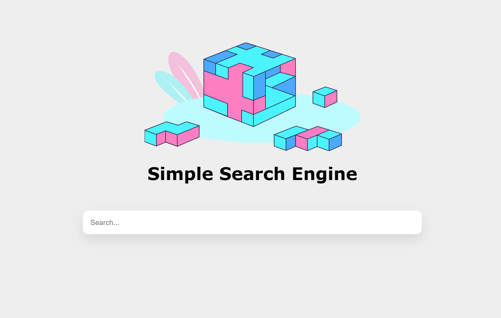

# simple-search-engine

## Requirements

- Python 3.9 or newer
- Nodejs

## Building

For backend,
```sh
cd backend
# Set up environment
pip install -r requirements.txt
python -m spacy download en_core_web_sm

# run backend server
flask run
```

For frontend,
```sh
cd frontend
npm install
npm start ng serve --open
```

You should see the web application at http://localhost:4200.



## References

The frontend Angular application is modified from [AldoHub/angular-search-engine](https://github.com/AldoHub/angular-search-engine). Thanks a lot.
